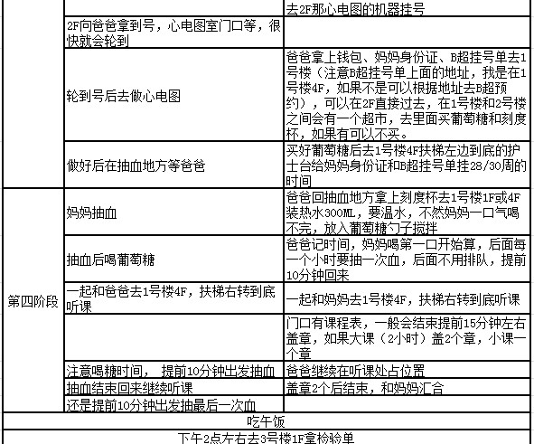

# 杭州妇保建大卡傻瓜式攻略

http://www.aliway.com/read.php?fid=73&tid=248129

下面排版分2条线，左边是指妈妈要做的事情，右边是指爸爸要做的事情

挂号

* 方法一：网上挂号 http://guahao.zjol.com.cn/ 选择浙江大学医学院附属妇产科医院里面的普通产科，下午3点开始可以挂号一周后的，建议同时多打开几个页面秒杀
* 方法二： 手机app挂号  浙江预约挂号

出发前一晚准备:刻度杯（超过300ML，没有的话可以早上去医院买）、市民卡(刷医保)、病历本、
准生证（刚刚开始预检会要，我老婆用到了，不知道是否必须）、勺子（搅拌葡萄糖用、
夹子或装文件的袋子（后面会有很多单子要放）、妈妈的身份证(挂B超要用)、钱包、妇幼保健册

我们是网上挂号72号，第2次抽血结束12点

还有如果妈妈买了下面这件衣服，不建议当天穿，因为去了后你会发现爸爸会找不到你，因为很多人穿。。。。
当天我目测遇到5位妈妈穿了这件衣服

[妇保建卡.xlsx](./pics/妇保建卡.xlsx)
