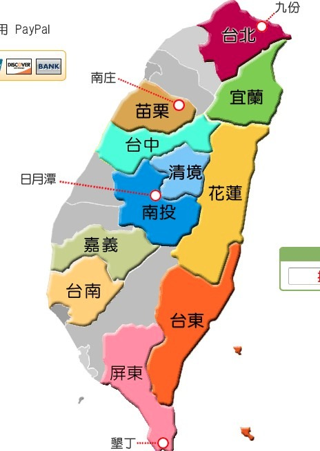

# 私奔到taipei

## 入台证

* [http://detail.tmall.com/item.htm?id=16880146328](http://detail.tmall.com/item.htm?id=16880146328)

## 台湾通行证申请表格下载

* [杭州](http://www.hzcrj.gov.cn/)

## 出入境管理局

* [广东省](http://www.gdcrj.com/)
* [杭州](http://www.hzcrj.gov.cn/)

## 查询通行证办理进度

* [广州](http://www.gdcrj.com/wsfwdt/zjsd/)
* [杭州](http://www.zjsgat.gov.cn:8080/was/portals/webSend/crj.jsp)

## 攻略

* [2011年9月CC - 11天台湾自由行攻略](http://www.douban.com/group/topic/22910437/)

## 民宿

* [疯台湾民宿网](http://www.fun-taiwan.com/)

* 花莲
  - [Hw32](http://hualien.fun-taiwan.com/OuterWeb/Container.aspx?hid=002-I041)
  - [迴音谷森林民宿官網](http://hualien.fun-taiwan.com/OuterWeb/Container.aspx?hid=002-418)
* 垦丁 http://kenting.fun-taiwan.com/
  - [恋海126](http://www.lovesea126.idv.tw/): 客满
  - 海堤: 客满


## 地图



## 行程 10天, 3.28 - 4.6

* 3.28 杭州 - 桃园机场 -- 高铁 -> 台北 - 淡水 住淡水 

早上8:30租车去机场

```
03 月 28 日 KA627 Dragonair  HGH 11:05   HKG 13:25  0  5:05 321  经济舱 Supersaver (S)
03 月 28 日 KA5420   Cathay Pacific  HKG 14:35   TPE 16:10  0   77W  经济舱 Supersaver (S)
```

[淡水宰相民宿](http://zs.okgo.tw/traffic.html)

```
※【捷運】搭乘捷運至淡水捷運站下車，往對面中油加油站旁的英專路步行約5分鐘，「淡水宰相民宿」就在墊腳石書局斜對面79巷進入，巷口有我們的招牌。

※【公車】可搭乘指2、指10、紅26、紅27、台汽、指南客運、淡水客運、三重客運或新店客運，於淡水站下車後，往對面中油加油站旁的英專路步行約5分鐘，「淡水宰相民宿」就在墊腳石書局斜對面79巷進入，巷口有我們的招牌。
```


* 3.29 台北
  * 坐高铁从机场到台北：去台北火车站拿一本时刻表，捷运时刻表
* 3.30 台北
* 3.31 台北 -- 基隆客运1602 -> 九份 住九份 [望琴海:海一海二](http://www.a-home.tw/2009/06/blog-post_24.html)

```
袁先生
您的訂單已確認  房間將為您保留 請放心
請您於訂房系統內以  查訂單  找出訂定單後以線上刷卡或paypal付訂金 (1/2)
 
請參考交通資訊: http://www.a-home.tw/2012/04/blog-post.html#more

當天您若於瑞芳火車站搭計程車上山 (費用約NT$200) 
請上車後來電 將告訴司機到達地點 (福山宮旁)
若搭巴士上山 請於老街下一站 隔頂 下車後來電 將去接您

您可於桃園機場購賣台灣手機及無線上網 費用約NT$450/7日, 需雙證件辦理
期待您的假期
梅姐
九份望琴海民宿
886-972-187565 (台灣手機打 0972-187565)
```


  
* 4.01 九份 -- 公交车 -> 瑞芳 -- 自强号 -> 花莲 住花莲 

坐车从九份到瑞芳火车站，然后做区间车去宜兰（如果有时间还可以在宜兰逛逛），然后换成区间车去花莲。

区间车可以随时买票上车，没座位能买站票

順行方向：臺北→花蓮→臺東→高雄→臺中→臺北　（環島鐵路順時針方向）

住：[知了居](http://www.cicada-home.com.tw/room01.html) 海风和明月

```
4/1 明月+海風 2400+2600=5000元 TWD
4/2 明月+诲風 （2400+2600）*0·9=4500元 TWD
住宿地址：花蓮市水源街55巷18號(鄰近松園別館) 
訂房專線：0921-250066‧(03)832-9676
電子信箱：u8540ms51@gmail.com
```

  
* 4.02 花莲
* 4.03 花莲 -- 观光列车 -> 枋寮 -- 租车(1000 NT) -> 垦丁 住垦丁

[小径](http://www.kenting.net.tw/)


* 4.04 垦丁
  - 租机车游恒春半岛一圈
* 4.05 垦丁
  - 去恒春买水果
  - 音乐节, 4人日票: 5135NT , 1075RMB
  
```
取票：
墾丁門市取票 (無停車位) -適合港澳遊客或無交通工具者 
屏東縣恆春鎮墾丁路34-1號
订单号 8111
姓名  郭舟东
```
  
* 4.06 垦丁 - 台北 - 杭州
    - 6:30  打车，车程约2个小时
    - 8:50  到左营高铁站，银联购买4张到桃园站的票
    - 9:18  搭乘左营到桃园的高铁，车程1小时40分钟
    - 10:54 到达桃园高铁，做机场接驳巴士，车程15分钟
    - 11:15 到桃园机场，出境后到免税购物。。。
    - 13:30 飞机起飞，返杭 
    - 19:00 到达杭州

```
04 月 06 日 KA5495   Cathay Pacific  TPE 13:30   HKG 15:10  0  4:40 744  经济舱 Supersaver (S)
04 月 06 日 KA636 Dragonair  HKG 16:00   HGH 18:10  0   320  经济舱 Supersaver (S)
```

## 交通

* [高铁](http://www.thsrc.com.tw/tc/index.asp)

[垦丁到台北机场](http://www.douban.com/group/topic/19442642/):
我记得从高雄出发还要坐2个小时左右的高铁呢~所以还是早上出发吧，到了台北车站有大巴直接到桃园机场，还要大概一个小时，价格NT125

## 费用

* 机票 8332 RMB
* 宰相民宿: 3天两间房 9400 NT = 2000 RMB
* 九份ahome的费用：1天，4300 NT = 914 RMB
* 花莲知了居 4/1 明月+海風 2400+2600=5000元 , 4/2 明月+诲風 （2400+2600）*0·9=4500元, 共 9500 NT = 2021 RMB
* 垦丁春浪音乐节门票, 4人日票: 5135NT = 1075 RMB

