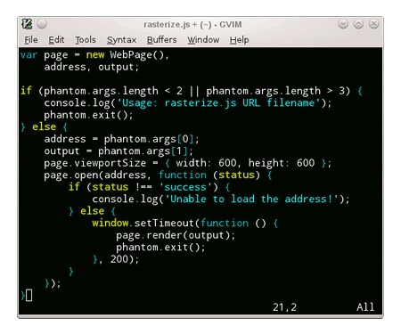

# Javascript

## Articles

* [JavaScriptThe Right Way.](http://jstherightway.com/)
* [Javascript模块化编程（一）：模块的写法](http://www.ruanyifeng.com/blog/2012/10/javascript_module.html)
* [[译]JavaScript:什么时候能用==](http://www.cnblogs.com/ziyunfei/archive/2012/09/22/2696109.html)
* [开源JavaScript执行热图生成工具](http://www.alloyteam.com/2012/06/javascript-the-profiler/)
* [http://calendar.perfplanet.com/2010/bulletproof-javascript-benchmarks/](http://calendar.perfplanet.com/2010/bulletproof-javascript-benchmarks/)
* [Faster JavaScript Trim](http://blog.stevenlevithan.com/archives/faster-trim-javascript)
* [Google JavaScript代码风格指南](http://chajn.org/jsguide/javascriptguide.html)
* [Testing getters and setters, and Object.defineProperty](http://robertnyman.com/javascript/javascript-getters-setters.html#regular-getters-and-setters)
* [Javascript编程风格](http://www.ruanyifeng.com/blog/2012/04/javascript_programming_style.html)
* [JavaScript date parsing and formatting, Part 1](http://www.xaprb.com/blog/2005/12/12/javascript-closures-for-runtime-efficiency/)
* [google js style comments](http://google-styleguide.googlecode.com/svn/trunk/javascriptguide.xml#Comments)
* [jsdoc tags](http://code.google.com/p/jsdoc-toolkit/wiki/TagReference)
* [通过对象图学习JAVASCRIPT](http://www.trans4fun.org/tag/object-graphs/)
* [Javascript绝句欣赏](http://site.douban.com/widget/notes/22456/note/142716442/)
* [A Case Against Using CoffeeScript](http://ryanflorence.com/2011/2012/case-against-coffeescript/)
* [Working with Binary Data using Typed Arrays](http://blogs.msdn.com/b/ie/archive/2011/12/01/working-with-binary-data-using-typed-arrays.aspx)
* [Native Fullscreen JavaScript API (plus jQuery plugin)](http://johndyer.name/native-fullscreen-javascript-api-plus-jquery-plugin/)
* [PhantomJS](http://www.phantomjs.org/): PhantomJS is a headless WebKit with JavaScript API. It has fast and native support for various web standards: DOM handling, CSS selector, JSON, Canvas, and SVG.  

* [前端工程师的编码遭遇战](http://ued.taobao.com/blog/2011/08/26/encode-war/): 导语：由于历史原因，淘宝网的页面编码一直都是gbk，F2E手册中也有明确规范，刚开始的一段时间，F2E们并未遭遇太麻烦的乱码问题，大家相安无事，但随着淘宝的合作方越来越多，合作方的API接口编码可谓五花八门，淘宝的系统和第三方的数据对接之后就暴露出各式各样的乱码问题。有必要再把这个问题缕缕清楚。
* [编码大全 拔赤](http://www.slideshare.net/lijing00333/ss-9016595)
* [该死的URIencode](http://www.douban.com/note/176096200/)
* [javascript嵌套函数的效率问题](http://www.js8.in/809.html)， http://jsperf.com/nested-named-functions
* [A re-introduction to JavaScript](https://developer.mozilla.org/cn/A_re-introduction_to_JavaScript)
* [JavaScript: The World's Most Misunderstood Programming Language](http://javascript.crockford.com/javascript.html)
* [__proto__ : 實體關係的確定](https://developer.mozilla.org/zh_tw/Core_JavaScript_1.5_%E6%95%99%E5%AD%B8/%E5%86%8D%E8%AB%87%E5%B1%AC%E6%80%A7%E7%9A%84%E7%B9%BC%E6%89%BF/%E5%AF%A6%E9%AB%94%E9%97%9C%E4%BF%82%E7%9A%84%E7%A2%BA%E5%AE%9A)
* [CoffeeScript语言参考](http://www.ituring.com.cn/article/559)
* [正确使用JS中的正则](http://www.laruence.com/2009/08/09/1036.html): 啃爹的g和lastIndex
* [Loop Benchmarks](http://blogs.oracle.com/greimer/resource/loop-test.html)
* [insertAdjacentHTML() Enables Faster HTML Snippet Injection](http://hacks.mozilla.org/2011/11/insertadjacenthtml-enables-faster-html-snippet-injection/)

## Slides

* [Bytes and Blobs](http://davidflanagan.com/Talks/jsconf11/BytesAndBlobs.html)
