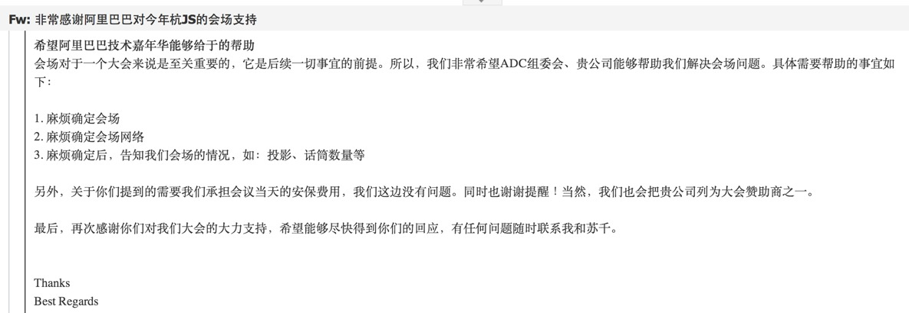
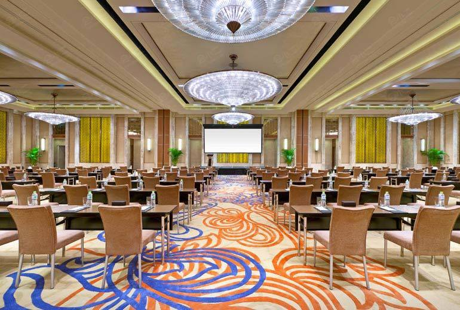
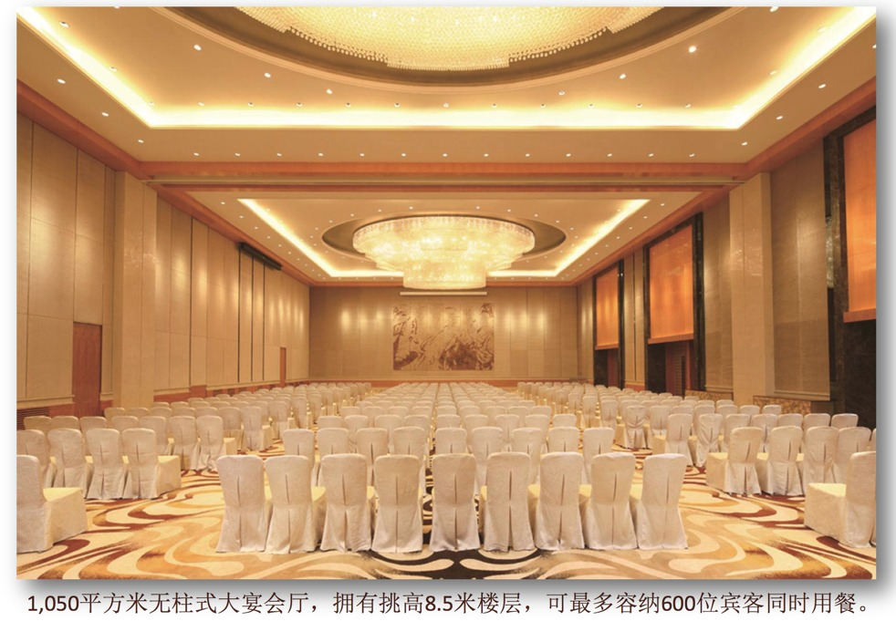
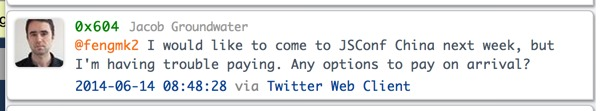
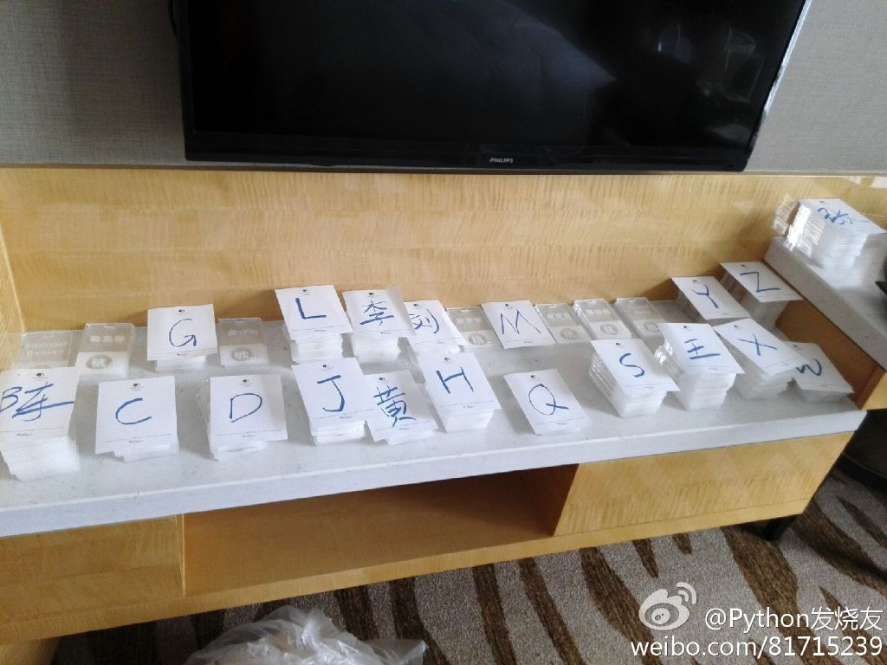
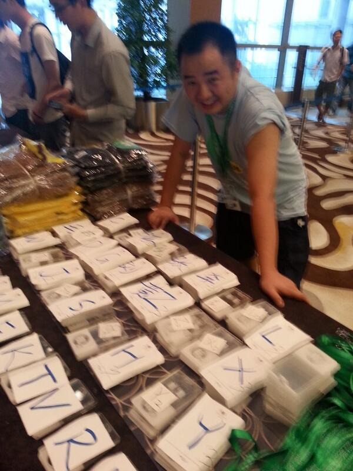
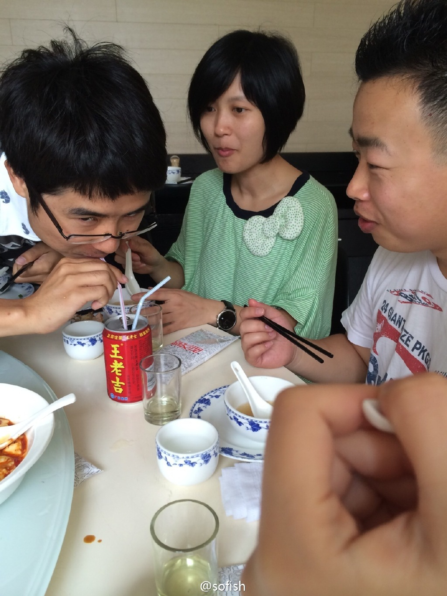
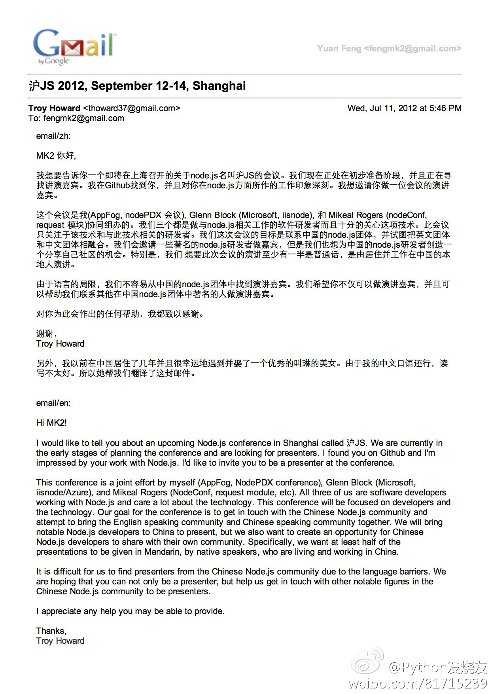
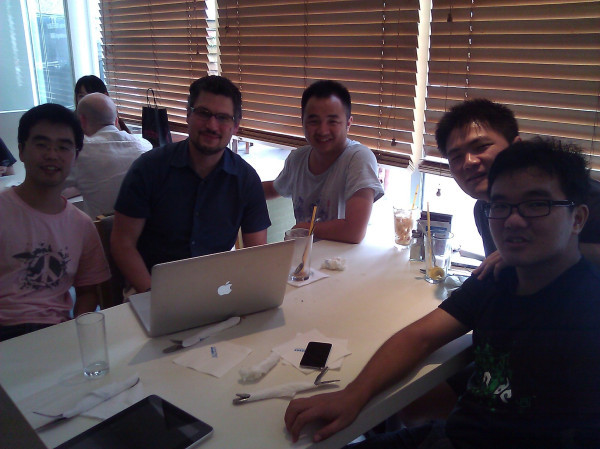
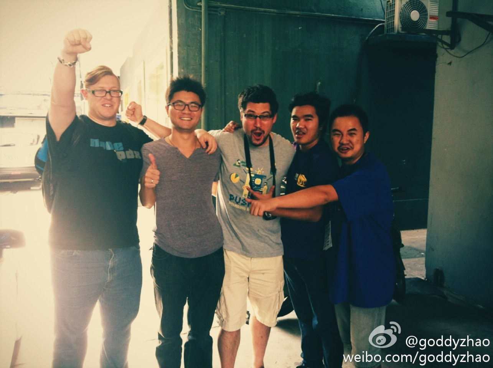

# 杭JS 二三事

---

# 关于 "酒店"

---

## 阿里巴巴西溪园区报告厅

最终因收费问题, 非阿里巴巴主办, 法务财务问题, 还只能在一个月前才能预定场地. 最终放弃了.

---

## 西溪喜来登

* 场地很赞的, 一开始我们是以阿里巴巴优惠价去谈的, 谈到的价格属于能承受的范围.
* 后来知道我们不是以阿里巴巴财务付款, 喜来登的销售马上就翻脸了, 之后就没有之后了.
* 投影仪需要1.2w一天, 2台2天需要4.8w, 再加上场地费, 远远超出预算了.

---

## 其他各种酒店

* 杭州花港海航度假酒店: 会场无法满足 >= 300人要求
* 浙江三立开元名都大酒店: 会场比较小, 感觉跟京JS的类似, 不过
* 海外海, ADC主办场地, 贵得不敢去现场看
* ...

---

## 下沙希尔顿

* 王雪销售经理 不知道从什么途径, 知道我们在杭州到处打听酒店会场的消息
* 开了一个天价: 宴会厅AB/课桌式/300/人民币60000元
* @如茵 出马, 砍价, 最终将希尔顿谈下来了.

---

## 关于 "消失的嘉宾"

* 连续第三年邀请 TJ, 今年他终于回邮件说可以录视频给我们. 但是最终还是没有收到他的视频 [#1](https://github.com/jsconfcn/hangjs/issues/1)
* [@jonathanong](https://github.com/jonathanong) koa, express 开发团队核心成员, 美籍华人, 最终因为临时有事和不喜欢中国食物, 选择不来了
* Guillermo Rauch, socket.io 作者, 在最后一个月, 去了多次中国大使馆, 还是无情地被中国拒签了.

---

## 关于 "突然出现的嘉宾"

* [Jacob Groundwater](https://github.com/groundwater), [NodeOS](http://node-os.com/) 作者, 从澳大利亚路过中国看望女朋友,
发现我们正在办 杭JS, 于是就来了.

---

## 关于 "挂牌" 优化

* 6.19 晚上, 我跟@goddyzhao 两个人, 在等嘉宾入住酒店的空闲时间, 将650+的挂牌的贴纸全部撕掉了
* 总结了去年混乱的入场场面, 按姓氏拼音做索引排序
* 发现有很多大姓, 于是将大姓单独索引
* 发现单字母下面还是挺多 items 的, 于是再按姓名字数做二级索引

---

## 关于 "工作人员"

* 今年将@沉鱼 拉入了组委会, 负责中国特色最重要的发票工作
* 找了家属们, 朋友帮忙签到
* 现场还拉了 @神仙, @翰文 帮忙做拍立得工作人员
* 感谢帮忙过 杭JS 的同学们

---

## 关于 "after party"

* after party 场地是按最多卖 300 张票规模找的
* 以吃饱喝饱聊饱为目的
* 让大家轻松开心度过
* 吃掉了 10个 12寸 披萨, 6个 16寸 披萨, 基本将烧烤店的冰箱清空了, 面包店的西点和熟食都被我买光了, 酒吧啤酒饮料只剩下不到一箱
* 我们专门定制了一个马卡龙, 不知道大家是否看到和吃到, 传说这在国外得在婚宴和特别重要的宴会上才能吃到.

---

## 关于 "怀孕"

* 3月初 @goddyzhao 说今年我们再办一次, @朴灵 说"好, 我怀孕了"
* 4月忙碌的时候, @goddyzhao 说让我再找多一个人帮忙, 他说: "老婆怀孕了, 而且也快生了"
* 五一假期的时候, 我回家一趟, 老婆很久没来例假, 我买了人生的第一个验孕棒, 中了. "我老婆也怀孕了"

---

# 会议现场: #hangjs# #杭JS#

---

## 一份历史邮件

当年 Troy 从联系上我的第一封原始邮件, 也是我收到的第一封包含中英文的邮件. PS: 这3年来, 我已经从害怕说英语, 到乐意说英语了.

---

## 第一次中美合作会面

---

## jsconfcn 团队

