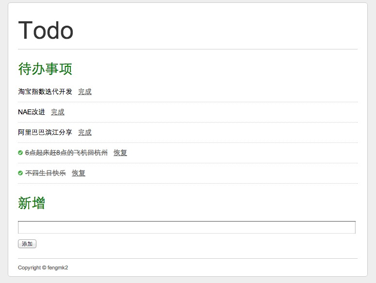
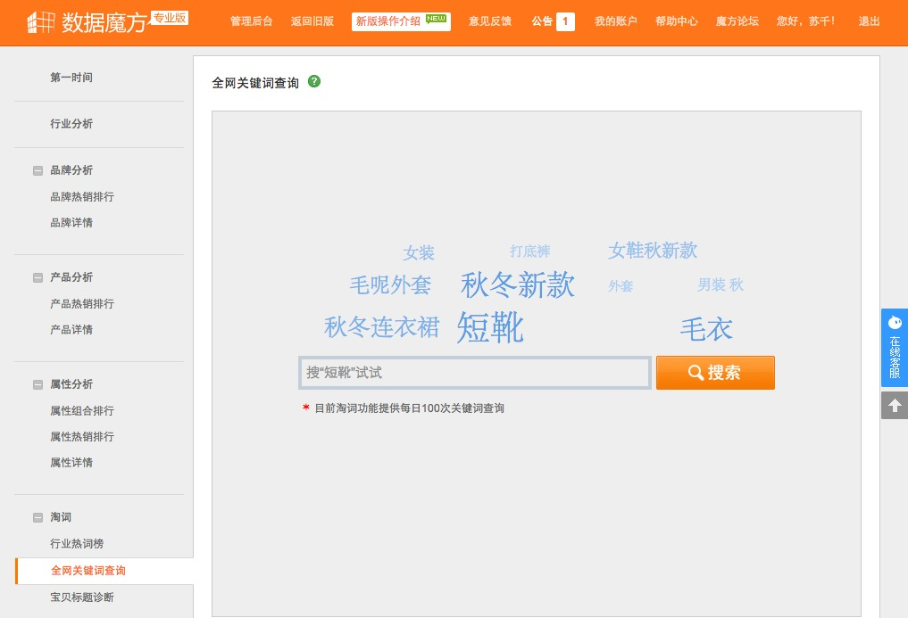
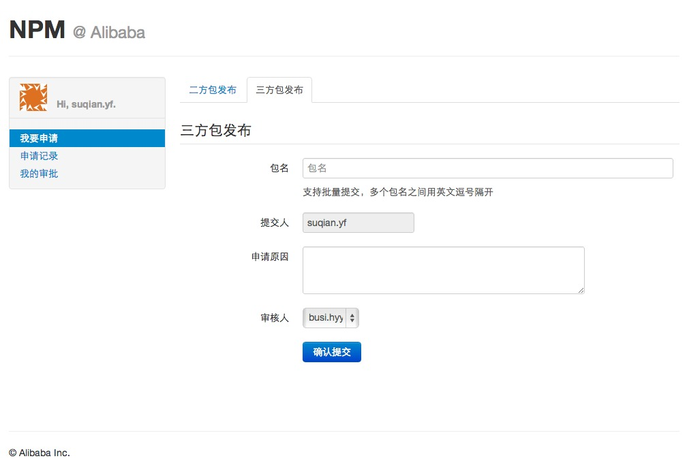

# Node.js 简介 <br>& 快速开发 Web 产品

---

## Who am I?我是谁？

### Alibaba Data EDP
### 阿里巴巴数据平台EDP，花名@苏千
### Chinese nodejs community: [cnodejs.org](http://cnodejs.org)

<hr/>

### npm: [cnpmjs.org/~fengmk2](http://cnpmjs.org/~fengmk2)
### Github: @[fengmk2](https://github.com/fengmk2/)
### Blog: http://fengmk2.github.com
### Twitter: @fengmk2
### Weibo: @Python发烧友 , @FaWave

---

## 内容简介

### * 简单介绍 Node.js 的历史以及现状
### * 以一个实用的Web小应用介绍基于 Node.js 的Web开发过程

---

# Node.js 简介

---

## 什么是 Node.js


---

## Node.js

### * 09年发布, 最新稳定版本 v0.10.26
### * [github stars 排名第三](https://github.com/search?q=stars%3A%3E1&s=stars&type=Repositories)


---

## Node.js 最常被提起的特性

### * 基于 google v8 引擎 (快速)
### * 事件驱动 (不同的编程思维)
### * ⾮阻塞I/O (⾼高效)
### * 单线程 (模型简单, ⽆锁)

---

## 事件循环


---

## NPM: Node Packaged Modules

### * 超过 64000+ 个模块
### * 跟随 Node.js 源码分发的包管理⼯工具
### * 精简的 Node.js 内核的丰富扩展


---

## NPM 模块数量增长惊人


---

## 谁在使用 Node.js?

[Learn More About The Node Community](http://strongloop.com/developers/node-js-infographic/)


---

# Node.js 到底能干吗?

---

## 服务器端

### * Web 服务
####   * restful API 服务
####   * 前后端彻底分离的web前端服务
####   * 全栈 web 应⽤
### * ⾼性能中间层
### * ⾼实时性应⽤用(游戏服务器/在线聊天室)

---

## 服务器端


---

## 前端工具


---

## 更多领域


---

## Node.js 简介小结

### * Node.js 还在飞速发展中
### * Node.js 不仅仅能做服务端开发, 还能做你没想象到的
### * 等待你开启人生的第一个 node 进程

---

# 什么是 Web 开发

---

## Web开发

* HTTP
* Request
* Response
* Cookie
* Session
* URL routing
* Template Engine
* DataBase

---

# Why Nodejs?

---

## IO密集型

### * 磁盘IO：读写文件
### * 网络IO：数据库，Cache，Services
### * 进程：进程通信，进程调用

---

## V8有多快？


* [fibonacci(40) benchmark](/blog/2011/fibonacci/nodejs-python-php-ruby-lua.html)

---

## 高楼平地起: Hello World

[helloworld.js](https://github.com/fengmk2/nodejs-web-dev/blob/master/helloworld.js)
```js
var http = require('http');
http.createServer(function (req, res) {
  console.log('%s %s : %j', req.method, req.url, req.headers);
  req.on('end', function () {
    res.writeHeader(200, { 'Content-Type': 'text/html' });
    res.end('Hello QCon Hangzhou');
  });
}).listen(1984);
```

<hr/>

### Event driven: req.`on`(`'end'`, function () {})

---

## 看看得到什么


---

## console.log()

```bash
$ node helloworld.js

GET / : {"host":"localhost.cnodejs.org:1984","connection":"keep-alive","cache-control":"max-age=0","user-agent":"Mozilla/5.0 (Macintosh; Intel Mac OS X 10_8_2) AppleWebKit/537.4 (KHTML, like Gecko) Chrome/22.0.1229.79 Safari/537.4","accept":"text/html,application/xhtml+xml,application/xml;q=0.9,*/*;q=0.8","accept-encoding":"gzip,deflate,sdch","accept-language":"zh-CN,zh;q=0.8,en;q=0.6,en-US;q=0.4","accept-charset":"GBK,utf-8;q=0.7,*;q=0.3"}

GET /favicon.ico : {"host":"localhost.cnodejs.org:1984","connection":"keep-alive","accept":"*/*","user-agent":"Mozilla/5.0 (Macintosh; Intel Mac OS X 10_8_2) AppleWebKit/537.4 (KHTML, like Gecko) Chrome/22.0.1229.79 Safari/537.4","accept-encoding":"gzip,deflate,sdch","accept-language":"zh-CN,zh;q=0.8,en;q=0.6,en-US;q=0.4","accept-charset":"GBK,utf-8;q=0.7,*;q=0.3"}
```

---

# 说笑吧，太简单了吧

---

## Simple todo

使用 [`leveldb`](https://github.com/rvagg/node-levelup) 存储，快速实现最简单的两个功能:

### * 添加任务
### * 显示任务
### * 完成任务

---

## 目录结构

```bash
$ tree -I node_modules
.
├── Makefile
├── README.md
├── app.js
├── common
│   └── db.js
├── config.js
├── controllers
│   ├── home.js
│   └── task.js
├── package.json
├── proxy
│   └── task.js
├── public
│   ├── images
│   │   ├── doing.gif
│   │   └── finished.jpg
│   └── styles
│       ├── index
│       │   ├── images
│       │   │   ├── bg_1.png
│       │   │   ├── email.png
│       │   │   ├── home.png
│       │   │   ├── msn.png
│       │   │   ├── ok.gif
│       │   │   ├── qq.png
│       │   │   └── website.png
│       │   └── style.css
│       └── reset.css
├── routes.js
└── views
    ├── error.html
    ├── index.html
    ├── layout.html
    └── task
        └── edit.html
```

---

## package.json

### 使用 npm init 生成项目的 package.json

```bash
$ npm init
```

## 使用强大的第三方模块加速开发效率

### 依赖模块:

```json
  "dependencies": {
    "utility": "0.1.11",
    "connect": "2.6.0", // web server, static files hosting
    "urlrouter": "0.2.3", // url routing
    "connect-render": "0.1.7", // ejs template engine helper
    "level": "0.18.0" // leveldb client
  }
```

---

## 主页面效果

### HTML + CSS，服务器端使用 [ejs] 模板引擎渲染


---

## 主页面 URL Routing

### URL路由简单明了

```js
var home = require('./controllers/home');
// HTTP GET / => home controller
app.get('/', home);
```

---

## Home Controller

```js
module.exports = function home(req, res, next) {
  res.render('index.html', {
    tasks: [] // 稍后会增加数据库逻辑
  });
};
```

---

## `index.html` 模板

```html
<div class="box todos">
  <h2 class="box">待办事项</h2>
  <ul>
    <% for (var i = 0; i < tasks.length; i++) {
      var task = tasks[i];
      var classname = task.finished ? 'class="finished"' : '';
    %>
      <li <%- classname %>>
        <% if (!task.finished) { %>
          <%= task.title %>
          &nbsp;
          <a href="/task/<%- task.id %>/finish">完成</a>
        <% } else { %>
          <del><%= task.title %></del>
          &nbsp;
          <a href="/task/<%- task.id %>/unfinish">恢复</a>
        <% } %>
      </li>
    <% } %>
  </ul>
</div>
```

---

## 静态文件服务

### 直接使用 [connect] 的 static 中间件模块

```js
app.use('/public',
  connect.static(path.join(__dirname, 'public')));
```

### CSS，图片，客户端脚本

```html
<link href="/public/styles/reset.css" rel="stylesheet" type="text/css" />
<link href="/public/styles/index/style.css" rel="stylesheet" type="text/css" />
```

---

## 添加任务

### URL路由配置

```js
var task = require('./controllers/task');

app.post('/task', task.add);
```

### HTML模板及CSRF保护

```html
  <div class="box post">
    <h2>新增</h2>
    <form action="/task" method="post" id="post_new">
      <input type="hidden" name="_csrf" value="<%- _csrf %>" />
      <p><input type="text" name="title" class="long_txt" /></p>
      <p><input type="submit" class="submit" value="添加" /></p>
    </form>
  </div>
```

---

## 添加任务 controller 实现代码

```js
var Task = require('../proxy/task');

exports.add = function (req, res, next) {
  var title = req.body.title;
  var task = { title: title, finished: 0, created_at: new Date() };
  Task.insert(task, function (err, item) {
    if (err) {
      return next(err);
    }
    res.writeHeader(302, {
      Location: '/'
    });
    res.end();
  });
};
```

---

## 在主页面上显示刚才添加的任务

```js
var Task = require('../proxy/task');

module.exports = function home(req, res, next) {
  Task.list(function (err, tasks) {
    if (err) {
      return next(err);
    }
    res.render('index.html', {
      tasks: tasks
    });
  });
};
```

---

## 添加任务效果


---

## 完成任务

### URL Routing

```js
// GET /task/50843cf924438a2dfa000001/finish
app.get('/task/(:id)/finish', task.finish);
```

### controller 实现代码

```js
exports.finish = function (req, res, next) {
  var tid = req.params.id; // mapping from url
  var task = { finished: 1, updated_at: new Date() };
  Task.updateById(tid, task, function (err, item) {
    if (err) {
      return next(err);
    }
    res.writeHeader(302, {
      Location: '/'
    });
    res.end();
  });
};
```

---

## 整体效果



---

## Talk is cheap

### 删除任务，编辑任务，用户系统...，剩余的功能，等你来完成。

## “自己动手，丰衣足食”

### fork [github.com/fengmk2/nodejs-web-dev](https://github.com/fengmk2/nodejs-web-dev/tree/master/todo/connect), then do it.

---

# 应用展示

---

## 淘宝指数


---

## 数据魔方



---

## 内部 NPM Web



---

## CNodejs 社区


---

## cnpmjs.org

https://github.com/cnpm/cnpmcore

---

## 推荐资源

### * [The Node Beginner Book](http://www.nodebeginner.org/), 中文版: [Node入门](http://www.nodebeginner.org/index-zh-cn.html)
### * @朴灵 [深入浅出Node.js](http://book.douban.com/subject/25768396/)
### * [七天学会NodeJS](http://nqdeng.github.io/7-days-nodejs/)
### * [StrongLoop blog](http://strongloop.com/strongblog/) 绝对是 Node.js 最新知识的权威博客

---

[/ppt/nodejs-web-dev.html](/ppt/nodejs-web-dev.html)

# web.emit(`'Thanks'`) <br/>&&<br/> console.log(`'end'`);


 [connect]: https://github.com/senchalabs/connect
 [ejs]: https://github.com/visionmedia/ejs
 [koa]: https://github.com/koajs/koa
