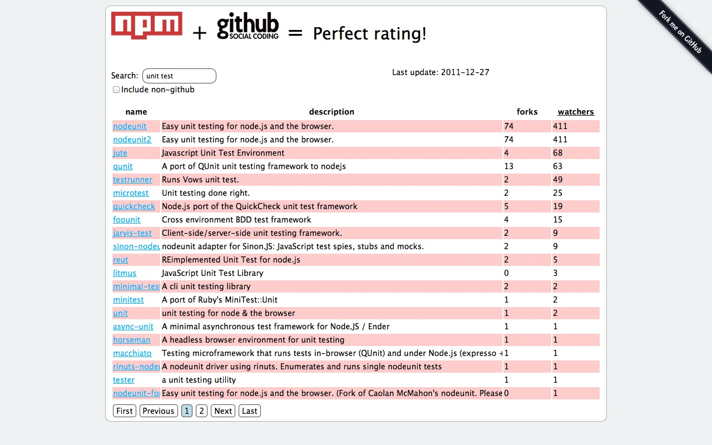
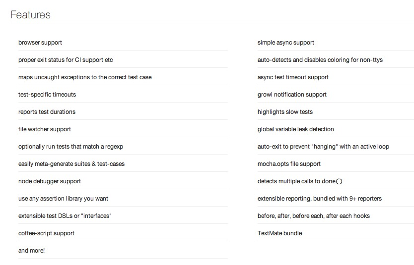
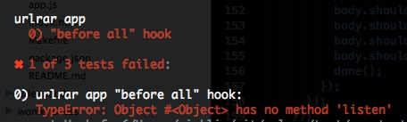
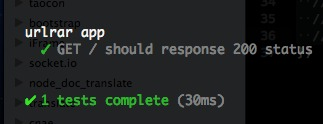
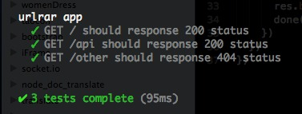

# UnitTest in Nodejs <br/> 实战Nodejs单元测试

---

## Who am I?我是谁？

### Alibaba [Data](http://tbdata.org/) EDP
### 阿里巴巴数据平台EDP，花名@苏千
### CNode, Chinese nodejs community [cnodejs.org](http://cnodejs.org)

<hr/>

### Github: @[fengmk2](https://github.com/fengmk2)
### Blog: http://fengmk2.github.com
### Twitter: @fengmk2
### Weibo: @Python发烧友 , @FaWave

---

## 大纲

* 为什么要单元测试
* Nodejs的单元测试模块
* 实战短址还原的单元测试

---

## 为什么要单元测试

### 明显没错的代码

[connect-redis.js#L80](https://github.com/visionmedia/connect-redis/blob/master/lib/connect-redis.js#L80)

```js
RedisStore.prototype.get = function(sid, fn){
  sid = this.prefix + sid;
  this.client.get(sid, function(err, data){
    try {
      if (!data) return fn();
      fn(null, JSON.parse(data.toString()));
    } catch (err) {
      fn(err);
    } 
  });
};
```

---

## 没明显错的代码

[node-mysql/lib/query.js#L65](https://github.com/felixge/node-mysql/blob/ecbb9f95d05348713e792e331412fa233095f798/lib/query.js#L65)

```js
if (buffer) {
  row[field.name] += buffer.toString('utf-8');
} else {
  row[field.name] = null;
}
```

---

## 明显有错的代码

[node0.6.6 - lib/http.js](https://github.com/joyent/node/blob/9a059ea69e1f6ebd8899246682d8ca257610b8ab/lib/http.js#L961)

```js
Agent.prototype.removeSocket = function(s, name, host, port) {
  if (this.sockets[name]) {
    var index = this.sockets[name].indexOf(s);
    if (index !== -1) {
      this.sockets[name].splice(index, 1);
    }
  } else if (this.sockets[name] && this.sockets[name].length === 0) {
    // don't leak
    delete this.sockets[name];
    delete this.requests[name];
  }
  if (this.requests[name] && this.requests[name].length) {
    // If we have pending requests and a socket gets closed a new one
    // needs to be created to take over in the pool for the one that closed.
    this.createSocket(name, host, port).emit('free');
  }
};
```

---

## 为什么要单元测试

### 代码质量

代码质量如何度量？
如果没有测试你如何保证你的代码质量？

### 敏捷快速地适应需求

单元测试是否也能让产品经理看得懂？
单元测试是否也能成功一个产品需求的Case？

### 重构

你有足够信心在没有单元测试的情况下发布你的重构代码吗？
如何检测你重构的代码符合需要？

### 增强自信心

全是绿灯！
单元测试全部跑通！

---

## 眼花缭乱的Nodejs测试模块



---

## [Testing / Spec Frameworks](https://github.com/joyent/node/wiki/modules#wiki-testing)

* [nodeunit](https://github.com/caolan/nodeunit) TDD
* [Expresso](https://github.com/visionmedia/expresso) TDD (Be sure to check out Expresso's successor Mocha.)
* [Vows](https://github.com/cloudhead/vows) BDD
* [Mocha](https://github.com/visionmedia/mocha) BDD
* [should](https://github.com/visionmedia/should.js) BDD

BDD: behaviour-driven development

---

## 如何选择

* 示例完整，上手容易，特别是本身就带有很好的示例
* 文档完善
* 在许多项目中被使用
* 准确友好的测试报告
* 持续改进

---

## Mocha ，我喜欢



---

## Mocha 强大的特性列表

* browser support | 浏览器支持
* simple async support | 非常简单自然地支持异步方式
* maps uncaught exceptions to the correct test case | 将未捕获异常对应到正确的测试用例
* test-specific timeouts | 能指定具体测试超时时间
* reports test durations | 测试时间报告
* highlights slow tests | 慢测试高亮显示
* use any assertion library you want | 使用任意你想使用的断言库
* extensible reporting, bundled with 9+ reporters | 可扩展的报告，并默认自动9中报告格式
* before, after, before each, after each hooks | 各种想当然的钩子方法
* ......

---

## should.js 我应该

我承认，我是@TJ 忠实粉丝...
还有，我喜欢 should 的方式:

* 代码写起来有意思
* 让懂英文的产品经理能基本看懂测试用例

---

# A cup of `Mocha`, <br/>test cases `should` pass.

---

## 实战短址还原的单元测试

短址还原: [urlrar](https://github.com/fengmk2/urlrar)


---

## 代码目录，创建响应空文件

```
├─┬ lib/
│  └── urllib.js
├─┬ test/
│  ├── app.test.js
│  ├── mocha.opts
│  └── urllib.test.js
├─┬ node_modules/
│  ├── mocha/
│  ├── should/
│  └── supertest/
├── app.js
├── index.html
├── Makefile
├── package.json
└── RERAME.md
```

---

## Makefile

```bash
TESTS = test/*.test.js
REPORTER = spec
TIMEOUT = 10000
JSCOVERAGE = ./node_modules/jscover/bin/jscover

install:
  @npm install

test:
  @NODE_ENV=test ./node_modules/mocha/bin/mocha \
    --reporter $(REPORTER) \
    --timeout $(TIMEOUT) \
    $(TESTS)

test-cov: lib-cov
  @URLRAR_COV=1 $(MAKE) test
  @URLRAR_COV=1 $(MAKE) test REPORTER=html-cov > coverage.html

lib-cov:
  @rm -rf $@
  @$(JSCOVERAGE) lib $@

.PHONY: install test test-cov lib-cov
```

---

## 运行测试

### 普通单元测试

```bash
$ make test
```

### 代码覆盖率

```bash
$ make test-cov
```

---

## mocha.opts

### 自定义mocha更多参数，例如自动引用一些测试依赖的模块

```
--require should
```

---

## 方便地进行 http 测试

使用 [supertest](https://github.com/visionmedia/supertest)

```js
request(app)
.get('/foo')
.set('x-userid', 'mk2')
.expect('X-Power-By', 'Nodejs')
.expect(200, done);
```

---

## 确定需求和应用功能

### 需求

* 将一个短网址 http://t.cn/StVkqS 还原得到最原始网址 http://nodejs.org/community/
* 有一个应用主页面
* 提供API，并支持浏览器能直接调用

### 应用功能

* 短网址还原应用
* 主页面显示介绍和表单，用户可以输入短网址，提交后显示还原结果
* 支持JSONP的短还原API

---

## 行为驱动开发: 实现 “主页面显示介绍和表单” 

直接写测试吧：`test/app.test.js`

```js
var request = require('supertest');
var app = require('../app');

describe('urlrar app', function () {
  before(function (done) {
    app.listen(0, done);
  });
```

---

## 将需求变成测试用例

```js
it('GET / should show the title, a form and a text input', function (done) {
  request(app)
  .get('/')
  .expect(200)
  .expect('X-Power-By', 'Nodejs')
  .end(function (err, res) {
    var body = res.text;
    // 主页面显示介绍和表单
    body.should.include('<title>Shorten URL Expand</title>');
    body.should.include('<form');
    body.should.include('</form>');
    body.should.include('<input');
    done(err);
  });
});
```

---

## 疯了吧？！直接运行测试

```
$ make test
```



---

## 实现app.js

```js
var http = require('http');
var parse = require('url').parse;
var fs = require('fs');

var indexHtml = fs.readFileSync('./index.html');

var app = http.createServer(function (req, res) {
  res.setHeader('X-Power-By', 'Nodejs');
  res.setHeader('Content-Type', 'text/html');
  var info = parse(req.url, true);
  if (info.pathname === '/') {
    res.end(indexHtml);
  } 
});

module.exports = app;
```

---

## 再次运行测试

```
$ make test
```



---

## 将应用API和404页面完成

```js
it('GET /api should have an api', function (done) {
  request(app)
  .get('/api')
  .expect(200)
  .expect('X-Power-By', 'Nodejs', done);
});
it('GET /other should not found the page', function (done) {
  request(app)
  .get('/noexists')
  .expect(404)
  .expect('Page Not Found!', done);
});
```



---

## 实现还原功能

### `lib/urllib.js` 模块来处理

使用方式将大致想象为如下：

```js
var urllib = require('./lib/urllib');
urllib.expand(shortenURL, function (err, longURL, redirectCount) {
  // go on...
});
```

---

## urllib.test.js

### Test Cases

```js
var mapping = [ 
  [ 'http://www.baidu.com/', 'http://www.baidu.com/' ],
  [ 'http://t.cn/StVkqS', 'http://nodejs.org/community/' ],
  [ 'http://url.cn/48JGfK', 'http://baike.baidu.com/view/6341048.htm' ],
  [ 'http://t.cn/aK1IFu', 'http://v.youku.com/v_show/id_XMjc2MjY1NjEy.html' ],
   // 2 times redirect
  [ 'http://url.cn/3OMI3O', 'http://v.youku.com/v_show/id_XMjc2MjY1NjEy.html', 2 ],
  [ 'http://luo.bo/17221/', 'http://luo.bo/17221/' ],
  [ 'http://t.itc.cn/LLHD6', 'http://app.chrome.csdn.net/work_detail.php?id=57' ],
];
```

---

## 正常使用方式测试

```js
var desc = 'should expand ' + mapping.length + ' shorten urls success';
it(desc, function (done) {
  var counter = 0;
  mapping.forEach(function (map) {
    urllib.expand(map[0], function (err, longurl, redirectCounter) {
      should.not.exist(err);
      map[1].should.equal(longurl);
      if (map[2]) {
        redirectCounter.should.equal(map[2]);
      }
      if (++counter === mapping.length) {
        done();
      }
    })
  })
})
```

---

## urllib.js#expand() 实现

```js
exports.expand = function (url, callback) {
  var info = parse(url);
  var options = {
    hostname: info.hostname,
    path: info.path,
    method: 'HEAD'
  };
  var request = info.protocol === 'https:' ? 
    https.request : http.request;
  var req = request(options);
```

---

## urllib.js#expand()实现2

```js
  if (callback.__redirectCounter === undefined) {
    callback.__redirectCounter = 0;
  }
  req.on('response', function (res) {
    if (res.statusCode === 301 || res.statusCode === 302) {
      var location = res.headers['location'];
      if (++callback.__redirectCounter > exports.maxRedirect) {
        return callback(null, location, callback.__redirectCounter);
      }
      return exports.expand(location, callback);
    }
    callback(null, url, callback.__redirectCounter);
  });
  req.end();
};

exports.maxRedirect = 5;
```

---

## 非法输入参数情况

```js
it('should return empty string when shorturl set wrong', function (done) {
  urllib.expand('', function (err, longurl) {
    should.not.exist(err);
    should.not.exist(longurl);
    done();
  })
});

it('should throw error when pass null', function () {
  try {
    urllib.expand();
  } catch (e) {
    e.name.should.equal('TypeError');
    e.message.should.equal('undefined is not a function');
  }
  (function () {
    urllib.expand();
  }).should.throw();
  (function () {
    urllib.expand(null);
  }).should.throw();
});
```

---

## 服务器异常怎么办？

```js
  describe('expand() server Error', function () {
    var app = http.createServer(function (req, res) {
      res.destroy();
    });

    before(function (done) {
      app.listen(0, done);
    });

    it('should return error when server error', function (done) {
      var url = 'http://localhost:' + app.address().port + '/foo';
      urllib.expand(url, function (err, longurl) {
        should.exist(err);
        err.should.be.an.instanceof(Error);
        err.message.should.equal('connect ECONNREFUSED');
        done();
      });
    });
  });
```

---

## 处理异常

```js
  var req = request(options);
  req.on('error', function (err) {
    callback(err, url, callback.__redirectCounter);
  });
  req.on('response', function (res) {
    // ...
```

---

## 实现 API 功能

### 测试先行

```js
it('GET /api?u=http://t.cn/StVkqS should worked', function (done) {
  request(app)
  .get('/api?u=http://t.cn/StVkqS')
  .expect(200)
  .expect('http://nodejs.org/community/', done);
});
```

---

## 实现代码

```js
var app = http.createServer(function (req, res) {
  // ...

  if (info.pathname === '/api') {
    var query = info.query;
    if (!query.u) {
      return res.end('`u` argument required.')
    }
    urllib.expand(query.u, function (err, longurl) {
      if (query.cb) {
        longurl = query.cb + '(' + JSON.stringify(longurl) + ')';
      }
      res.end(longurl);
    });
    return;
  }

  // ...
});
```

---

## 绿灯通行

```bash
$ make test
```


---

## 辅助模块

* pedding: [https://github.com/fengmk2/pedding](https://github.com/fengmk2/pedding)
* mm: [https://github.com/fengmk2/mm](https://github.com/fengmk2/pedding), Mock Mate, Mock伴侣

---

## pedding: Just pedding for callback

例如上面出现的测试用例，验证的输入参数有多种情况，我们会使用计数器来判断是否全部完成。

```js
it(desc, function (done) {
  var counter = 0;
  mapping.forEach(function (map) {
    urllib.expand(map[0], function (err, longurl, redirectCounter) {
      should.not.exist(err);
      longurl.should.equal(map[1]);
      redirectCounter.should.equal(map[2]);
      if (++counter === mapping.length) {
        done();
      }
    })
  })
});
```

---

## 使用 pedding 之后

```js
it(desc + ' with pedding', function (done) {
  done = pedding(mapping.length, done);
  mapping.forEach(function (map) {
    urllib.expand(map[0], function (err, longurl, redirectCounter) {
      should.not.exist(err);
      longurl.should.equal(map[1]);
      redirectCounter.should.equal(map[2]);
      done();
    })
  })
});
```

---

## mm: Mock伴侣

mock mate, easy to mock `http` request, `fs` access and so on.


---

## 模拟 `fs.readFile` 返回错误

```js
var mm = require('mm');
var fs = require('fs');

mm.error(fs, 'readFile', 'mock fs.readFile return error');

fs.readFile('/etc/hosts', 'utf8', function (err, content) {
  console.log(err); // should return mock err: err.name === 'MockError'

  mm.restore(); // remove all mock effects.

  fs.readFile('/etc/hosts', 'utf8', function (err, content) {
    console.log(err); // should return null
    console.log(content); // should show the host list
  });
});
```

---

## 模拟任何你想返回的结果

```js
var fs = require('fs');
var mm = require('mm');

mm(fs, 'readFile', function (path, callback) {
  var content = new Buffer('file contents here');
  process.nextTick(callback.bind(null, null, content));
});
```

---

## 更多好的示例

* [Express](https://github.com/visionmedia/express/tree/master/test)
* [Connect](https://github.com/senchalabs/connect/tree/master/test)
* [SuperAgent](https://github.com/visionmedia/superagent/tree/master/test/node)
* [WebSocket.io](https://github.com/LearnBoost/websocket.io/tree/master/test)
* [Mocha](https://github.com/visionmedia/mocha/tree/master/test)

---

# QA === 知乎者也
